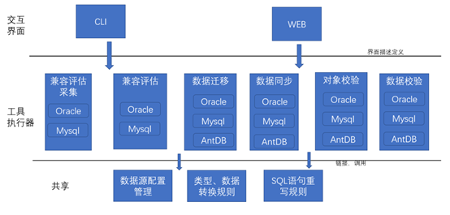
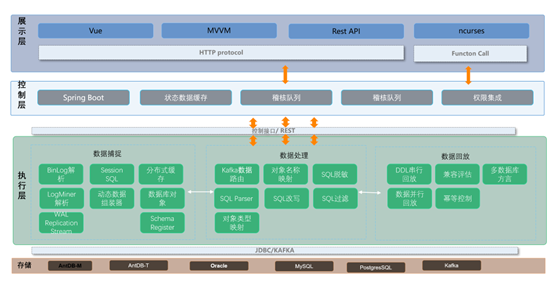

MTK 主要包含评估、迁移和校验，其整体的体系结构如下：

- 共享部分为MTK工具集中的基础设施，各个工具应该链接或者调用此部分的功能。
- 工具执行为执行的具体逻辑实现， 和交互界面组合可以产生不同的可执行程序或者WEB模块。
- 交互界面用来控制、配置工具执行器的行为， 定义统一的参数控制行为和展示行为。

MTK采用的整体的技术框架如下：

MTK采用JDBC方式连接到源端的数据，针对不用的数据进行数据和元数据的采集，这个根据不同的数据库进行处理
经采集的元数据通过数据结构转换，转换为目标端的数据库兼容的数据元数据。

MTK目标端采用JDBC的方式进行数据写入、更新和删除，